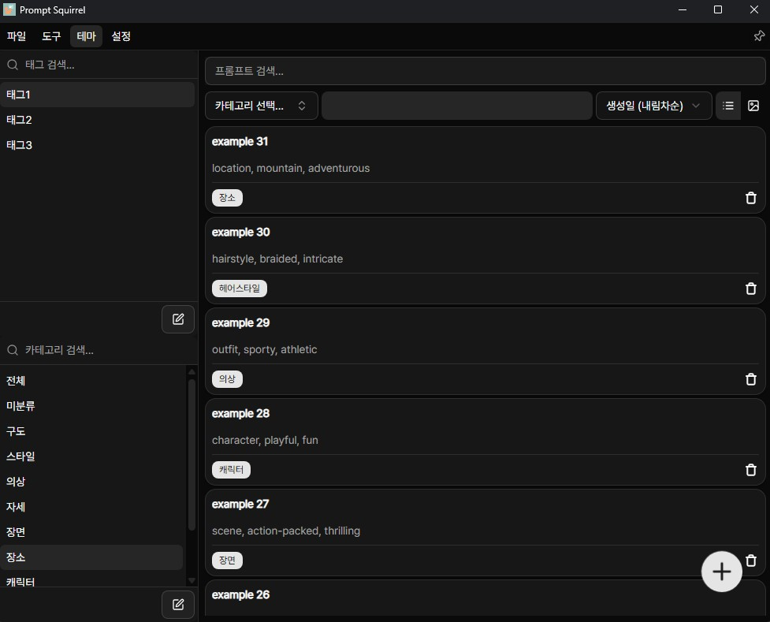
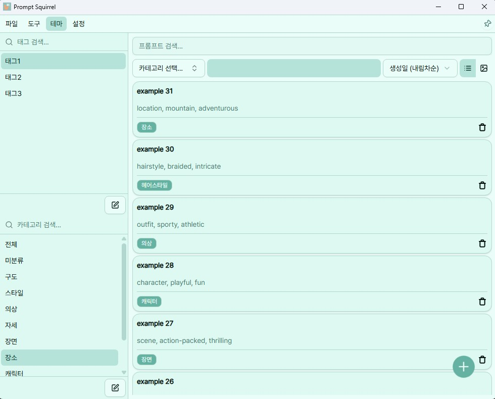
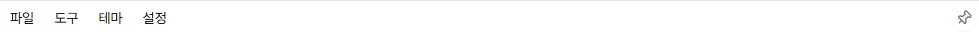
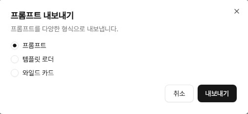
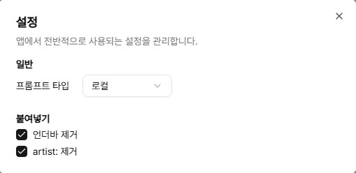
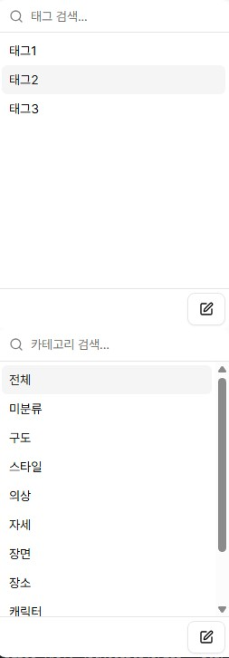
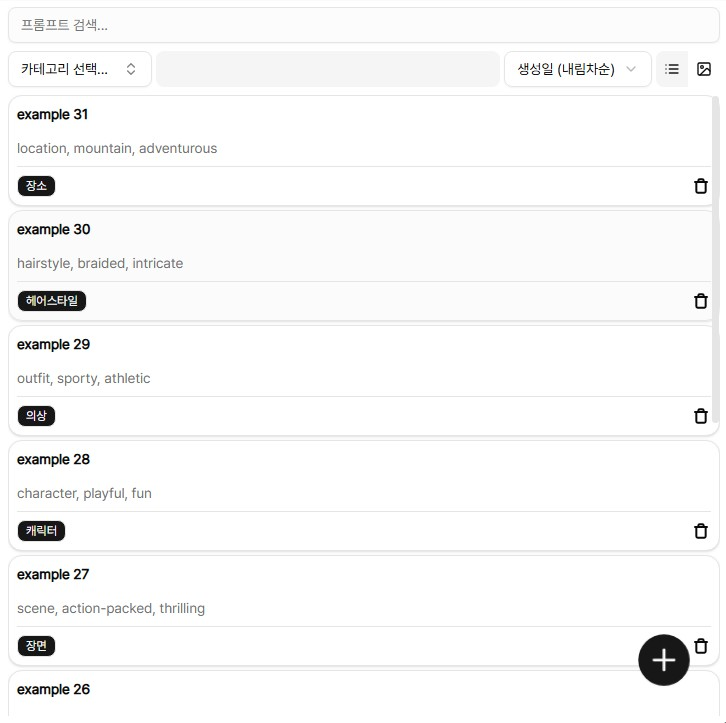

    
    <h1>Prompt Squirrel</h1>
    
프롬프트 관리 도구

<table align="center">
  <tr>
    <td></td>
    <td></td>
    <td></td>
  </tr>
</table>

<h1></h1>

# 소개
**Prompt Squirrel**은 프롬프트를 하나하나 모아두는 윈도우 앱입니다.  
다람쥐가 도토리를 저장하듯, 당신은 프롬프트를 저장하세요.  
다람쥐는 도토리를 어디에 숨겼는지 까먹지만, **우리는 까먹지 않습니다.**

# 기능

- [메뉴바](#메뉴바) - 불러오기 / 내보내기 / 테마 / 설정 / 윈도우 고정
- [사이드바](#사이드바) - 태그 박스 / 카테고리 박스
- [프롬프트](#프롬프트) - 검색, 필터링, 정렬, 뷰 모드

## 메뉴바

### 📁 파일

- **불러오기**  
  프롬프트 파일을 가져오면 기존 목록에 추가됩니다.  
  카테고리·태그도 함께 불러오며, 이름이 겹칠 경우 새로운 이름이 자동 생성됩니다.

- **내보내기**  
  현재 필터링된 프롬프트를 원하는 형식으로 저장할 수 있습니다.

  

  - Prompt Squirrel 전용 형식
  - 템플릿 로더 형식 - [Template Loader](https://github.com/r3dsd/comfyui-template-loader)에서 사용할 수 있는 JSON
  - 와일드 카드 - 각 프롬프트가 줄바꿈으로 구분된 텍스트 파일

### 🛠 도구  
- (미구현)

### 🎨 테마

- 다크 모드
- 라이트 모드
- 그린 모드
- 시스템 설정 연동

### ⚙️ 설정

- **프롬프트 타입**: 붙여넣기 시 적용할 타입 설정 (예: Local, NAI)
- **붙여넣기 옵션**:  
  - 언더바 제거 (`_`)
  - `artist:` 태그 제거

### 📌 핀 아이콘

- 활성화 시 윈도우 창을 항상 위로 고정합니다.

## 사이드바

### 🏷️ 태그 / 카테고리 박스

- **생성**: 입력한 내용이 없다면 새로 만듭니다.
- **검색**: 입력한 단어로 바로 필터링합니다.
- **삭제**: 조정 버튼 클릭 후 X 버튼으로 제거합니다.
- **필터링**: 클릭 시 해당 항목으로 프롬프트 목록이 AND 조건으로 필터링됩니다.

## 프롬프트 목록

### 🔍 검색

- 프롬프트 이름과 내용 기준으로 검색됩니다.

### 🔽 필터링

- 사이드바에서 선택한 태그·카테고리 기준으로 필터링됩니다.
- 프롬프트 하단에 존재하는 카테고리/태그 뱃지를 클릭하면 필터링 조건에 추가/제거됩니다.

### ↕ 정렬

- 이름순 또는 생성일순으로 정렬할 수 있습니다.

### 👁️ 뷰 모드

- **리스트 모드**: 텍스트 중심 목록
  - 프롬프트 클릭 시 클립보드 복사
  - 태그·카테고리 클릭 시 필터 조건에 반영
  - 카드 클릭 시 상세 보기
- **그리드 모드**: 이미지 중심 보기
  - 썸네일이 있을 경우 표시됨
  - 우클릭시 썸네일을 크게 표시합니다.