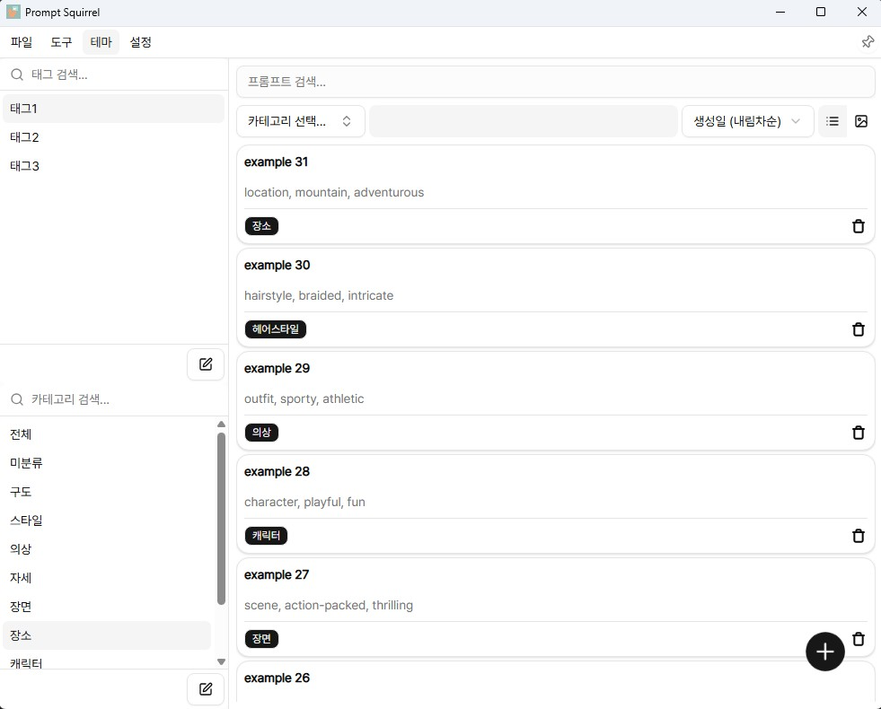

    
    <h1>Prompt Squirrel</h1>
    
Herramienta de gestión de prompts

<table align="center">
  <tr>
    <td></td>
    <td></td>
    <td></td>
  </tr>
</table>

<h1></h1>

# Introducción
**Prompt Squirrel** es una aplicación de Windows para gestionar prompts de manera eficiente. Similar a cómo una ardilla almacena nueces, esta herramienta permite guardar y organizar prompts de manera segura y accesible.

# Funcionalidades

- [Barra de Menú](#barra-de-menú) - Importar / Exportar / Temas / Configuración / Fijar Ventana
- [Barra Lateral](#barra-lateral) - Caja de Etiquetas / Caja de Categorías
- [Lista de Prompts](#lista-de-prompts) - Búsqueda, Filtrado, Ordenación, Modo de Vista

## Barra de Menú

### 📁 Archivo

- **Importar**  
  Al importar un archivo de prompts, se añadirá a la lista existente.  
  También se importarán categorías y etiquetas, y en caso de nombres duplicados, se generarán nuevos nombres automáticamente.

- **Exportar**  
  Los prompts filtrados actualmente se pueden guardar en el formato deseado.

  

  - Formato exclusivo de Prompt Squirrel
  - Formato de Cargador de Plantillas - JSON que se puede usar en [Template Loader](https://github.com/r3dsd/comfyui-template-loader)
  - Wild Card - Archivo de texto con prompts separados por saltos de línea

### 🛠 Herramientas  
- (No implementado aún)

### 🎨 Temas

- Modo Oscuro
- Modo Claro
- Modo Verde
- Sincronización con la Configuración del Sistema

### ⚙️ Configuración

- **Tipo de Prompt**: Configura el tipo que se aplicará al pegar (Ej: Local, NAI)
- **Opciones de Pegado**:  
  - Eliminar guiones bajos (`_`)
  - Eliminar la etiqueta `artist:`

### 📌 Icono de Fijar

- Al activarlo, la ventana se mantendrá siempre en la parte superior.

## Barra Lateral

### 🏷️ Caja de Etiquetas / Categorías

- **Crear**: Si no hay contenido ingresado, se creará uno nuevo.
- **Buscar**: Filtra inmediatamente por la palabra ingresada.
- **Eliminar**: Haz clic en el botón de ajuste y luego en la X para eliminar.
- **Filtrar**: Al hacer clic, la lista de prompts se filtrará con la condición AND correspondiente.

## Lista de Prompts

### 🔍 Búsqueda

- Busca prompts por nombre y contenido.

### 📋 Filtrado

- Filtra por categorías y etiquetas seleccionadas en la barra lateral.
- Haz clic en las categorías/etiquetas para añadir o eliminar condiciones de filtrado.

### ↕ Ordenar

- Ordena por nombre o fecha de creación.

### 👁️ Vista Modo

- **Modo Lista**: Lista centrada en texto
  - Haz clic en un prompt para copiarlo al portapapeles
  - Haz clic en una tarjeta para ver detalles
  - Haz clic en una tarjeta para aplicar condiciones de filtro
- **Modo Cuadrícula**: Vista centrada en imágenes
  - Se mostrará la miniatura si está disponible
  - Al hacer clic derecho, la miniatura se mostrará en un tamaño más grande.

### 📋 Vista Detallada

- Al hacer clic en un prompt, se mostrarán detalles adicionales.
- Se puede subir una miniatura mediante arrastrar y soltar.

### ➕ Añadir Nuevo Prompt

- Haz clic en el botón `+` en la parte inferior para añadir un nuevo prompt.